# Modernize Jeffershizzle — Final Plan v6

## Server Layout (E:\ drive)

```
E:\
├── dookydetective\          ← existing site
├── perihelion\              ← existing site (images API on :8010)
├── jeffershizzle-legacy\    ← source HTML (this workspace, read-only reference)
├── jeffershizzle\           ← NEW: images + API for the modernized site
│   ├── images\
│   │   ├── 001\             ← was EXP/00-mad/
│   │   ├── 002\             ← was EXP/0b-dvf/
│   │   ├── ...
│   │   └── 293\             ← was EXP/289-snu/
│   └── shares\              ← (if needed later)
├── scripts\
│   ├── perihelion_images_api.py      ← existing, port 8010
│   └── jeffershizzle_images_api.py   ← NEW, port 8030
└── other\
```

## All Decisions

| Decision | Value |
|----------|-------|
| **Domain** | `https://www.jeffershizzle.com` (A Small Orange) |
| **API port** | 8030 (separate from perihelion's 8010) |
| **API root** | `E:\jeffershizzle\images\` |
| **Tunnel name** | `api-jeffershizzle` (new) |
| **Tunnel URL** | e.g. `https://api.jeffershizzle.com` (you choose the subdomain) |
| **Dev/Build** | Separate computer → GitHub → deploy to ASO |
| **Images/API** | This home server (E:\ drive) |
| **Folder naming** | `001/`, `002/`, … `293/` |

---

## Architecture

```mermaid
graph TD
    subgraph "Dev Computer (separate)"
        DEV["jeffershizzle-modern/ repo"]
    end

    subgraph "GitHub"
        GH["Repository"]
    end

    subgraph "A Small Orange (www.jeffershizzle.com)"
        ASO["index.html + app.js + styles.css + manifest.json"]
    end
    
    subgraph "Home Server (E: drive)"
        API["jeffershizzle_images_api.py :8030"]
        IMG["E:/jeffershizzle/images/001..293/"]
        CF["cloudflared tunnel (api-jeffershizzle)"]
    end
    
    DEV -->|push| GH
    GH -->|deploy| ASO
    ASO -->|"viewer loads SPA"| VIEWER["Browser"]
    VIEWER -->|"fetch /images/056/photo.jpg"| CF
    CF --> API
    API --> IMG

    style ASO fill:#1a3a5c
    style API fill:#2d5a27
    style IMG fill:#4a3728
    style DEV fill:#5a3a6c
```



---

## Cloudflare Changes (Exact Steps)

### 1. Create a new tunnel

```bash
cloudflared tunnel create api-jeffershizzle
```

This will output a tunnel ID and create a credentials file at:
`C:\Users\Bill\.cloudflared\<tunnel-id>.json`

### 2. Create a DNS route

Pick a subdomain (I'd recommend `api.jeffershizzle.com`):

```bash
cloudflared tunnel route dns api-jeffershizzle api.jeffershizzle.com
```

> [!NOTE]
> This requires that `jeffershizzle.com` has its DNS managed by Cloudflare. If it's on A Small Orange's DNS, you'll need to either:
> - **Move DNS to Cloudflare** (recommended — just change nameservers at your registrar, keep ASO as the origin), or
> - **Use a different domain** that's already on Cloudflare (e.g., `jeffershizzle.jeffersonwm.com`)

### 3. Create a config file

Create `C:\Users\Bill\.cloudflared\config-jeffershizzle.yml`:

```yaml
tunnel: <tunnel-id-from-step-1>
credentials-file: C:\Users\Bill\.cloudflared\<tunnel-id>.json

ingress:
  - hostname: api.jeffershizzle.com
    service: http://localhost:8030
  - service: http_status:404
```

### 4. Run the tunnel

```bash
cloudflared tunnel run --config C:\Users\Bill\.cloudflared\config-jeffershizzle.yml api-jeffershizzle
```

Or if you use token files like your other tunnels:
```bash
cloudflared tunnel run --token-file C:\Users\Bill\.cloudflared\tokens\api-jeffershizzle.token
```

### 5. Update your startup notes

Add to `DOTCOM NOTES SERVER.txt`:
```
VSCODE -    python E:\scripts\jeffershizzle_images_api.py
VSCODE -    cloudflared tunnel run --token-file C:\Users\Bill\.cloudflared\tokens\api-jeffershizzle.token

cloudflared tunnel list should show
    api-perihelion
    api-dookydetective
    api-jeffershizzle
with active connections.
```

---

## Phase 1: Create Jeffershizzle API

A slimmed-down version of `perihelion_images_api.py`, tailored for this site:

#### [NEW] `E:\scripts\jeffershizzle_images_api.py`

- Based on perihelion API but simplified (no share/download features needed initially)
- `ROOT = Path(r"E:\jeffershizzle\images")`
- `PORT = 8030`
- CORS allows `https://www.jeffershizzle.com` and `https://jeffershizzle.com`
- Endpoints:
  - `GET /images/<path>` — serve image files
  - `GET /api/list?path=<dir>` — list folder contents (useful for debugging)
  - `GET /` — simple status page

---

## Phase 2: Copy + Rename Image Folders

#### [NEW] `E:\scripts\rename_jeffershizzle_galleries.py`

Copies images from `E:\jeffershizzle-legacy\EXP\` to `E:\jeffershizzle\images\` with renamed folders:

```python
renames = {
    "00-mad": "001",
    "0b-dvf": "002",
    "0c-jnz": "003",
    "0d-agk": "004",
    "01-nfv": "005",
    # ... all 293 mappings
    "289-snu": "293",
}
```

- **Copies, not moves** (preserves the legacy originals)
- Copies only the image files (`.jpg`, `.png`, etc.), not `.html` files
- Dry-run mode to verify before executing

---

## Phase 3: Fix Broken Links in Legacy Source

| File | Fix |
|------|-----|
| `dwi02.html` | `../bti.html` → `../btx.html` |
| `gtu.html` | Remove tab in filename reference |
| `oyg.html` + `oyg05.html` | `oyg14` → `oyg04` |
| `mad.html` | `../expfirst.html` → `../index.html` |

Orphan handling: append `x`/`z` as specified.

---

## Phase 4: Generate JSON Manifest

Extract all navigation from the legacy HTML into `manifest.json`:

```json
{
  "config": {
    "imageBaseUrl": "https://api.jeffershizzle.com/images"
  },
  "entry": {
    "id": "001",
    "category": "landing",
    "template": "pair-choice",
    "photos": [
      { "image": "R2-06618-006A.jpg", "enlargedLinksTo": "056" },
      { "image": "R2-06618-007A.jpg", "enlargedLinksTo": "194" }
    ]
  },
  "galleries": {
    "056": {
      "category": "city views",
      "template": "vertical-scroll-7",
      "photos": [
        { "image": "R1-02843-009A.jpg", "linksTo": "261" }
      ]
    }
  }
}
```

---

## Phase 5: Build SPA

Developed on your **dev computer**, pushed to GitHub, deployed to ASO:

```
jeffershizzle-modern/
├── index.html
├── css/styles.css         ← All 15 layout templates
├── js/
│   ├── config.js          ← API tunnel URL
│   ├── app.js             ← Router + renderer
│   └── transitions.js     ← Fade effects
├── manifest.json          ← Spiderweb data
└── .github/               ← (optional: auto-deploy workflow)
```

### Routing

```
#/              → Entry (001 / landing)
#/056           → Gallery (city views)
#/056/3         → Enlarged photo → click to navigate
#/browse        → Alphabetical category list (DONT rebuild)
```

---

## Build Order

1. ✅ **Analysis complete** — tree, connections, categories all mapped
2. → **Create API script** (`jeffershizzle_images_api.py` on port 8030)
3. → **Create rename script** (copy+rename 293 folders to `E:\jeffershizzle\images\`)
4. → **Fix broken links** in legacy source
5. → **Generate manifest.json** from legacy HTML
6. → **Build SPA** (index.html + CSS + JS)
7. → **You set up tunnel** (I provide exact commands)
8. → **Deploy to ASO** + test end-to-end

---

## Verification

- Link checker: 0 broken after fixes
- Manifest matches original link graph exactly
- All image files exist in renamed folders
- SPA renders all 15 layout types
- Images load through tunnel
- CORS works from jeffershizzle.com
