# Jeffershizzle Legacy — Site Structure Analysis

## Quick Answer

**The spiderweb is `EXP`.** The sequential category listing is `DONT`.

> [!WARNING]
> **Correction**: `EHX` was a separate, unfinished project. The category listing with all gallery names is **`DONT/dontindex.html`** (2,825 HTML files).

---

## How the Two Systems Differ

### `EXP/` — The Spiderweb (interconnected exploration)
- **~293 numbered subfolders** (e.g. `00-mad`, `01-nfv`, `52-rid`, … up to `289-snu`)
- **~348 HTML pages** at the top level of `EXP/`
- Each subfolder has its own images + individual HTML pages per photo
- Photos are interlinked **across** folders by thematic similarity — clicking a photo sends you to a *different* gallery page, not the next photo in the same set

### `DONT/` — The Sequential Category Listing (ordered viewing)
- `dontindex.html` lists all 301 categories alphabetically by name
- Each category has a gallery page (`00-mad.html`, `01-nfv.html`, etc.) with the same images as EXP
- Sub-pages use lettered format (`00a.html`, `00b.html`) — individual photo enlargements
- **2,825 HTML files** total — a complete parallel version of the spiderweb in flat/linear format
- Images are referenced from `../EXP/` folders (shared with the spiderweb)

### `EHX/` — Separate, Unfinished Project
- Not part of the spiderweb or category system
- Was started but never completed — ignore for modernization

---

## The EXP Spiderweb — Three-Layer Structure

The spiderweb navigation in `EXP/` works across **three layers**:

### Layer 1: Entry Page (e.g. `EXP/mad.html`)
- Shows **2 thumbnail photos** side by side in a table grid
- Instruction text: *"click one of the photographs to enlarge."*
- Each thumbnail links to a **Layer 2** page inside the subfolder (e.g. `00-mad/mad01.html`)
- Footer has a "back" link (to `expfirst.html` or `index.html`)

### Layer 2: Enlarged Single Photo (e.g. `EXP/00-mad/mad01.html`)
- Shows **1 photo** enlarged
- Instruction text: *"click again to see more photographs with a similar element."*
- Clicking the photo links to a **different** Layer 1 page — **this is the spiderweb link** (e.g. `mad01.html` → `rid.html`, `mad02.html` → `ejf.html`)
- Footer "back" link returns to the parent Layer 1 page (e.g. `mad.html`)

### Layer 1 (again): The Destination Gallery (e.g. `EXP/rid.html`)
- Shows **multiple photos** (7 in `rid.html`'s case) — each linking to its own Layer 2 pages
- Each of *those* Layer 2 pages links out to yet another gallery page (e.g. `rid01.html` → `qri.html`)
- And so it continues…

```mermaid
graph LR
    A["mad.html<br/>(2 photos)"] -->|click photo 1| B["mad01.html<br/>(1 enlarged)"]
    A -->|click photo 2| C["mad02.html<br/>(1 enlarged)"]
    B -->|click photo| D["rid.html<br/>(7 photos)"]
    C -->|click photo| E["ejf.html<br/>(gallery)"]
    D -->|click photo 1| F["rid01.html<br/>(1 enlarged)"]
    F -->|click photo| G["qri.html<br/>(gallery)"]
    D -->|click photo 2| H["rid02.html"]
    H -->|click photo| I["another gallery..."]
    
    style A fill:#2d5a27
    style D fill:#2d5a27
    style E fill:#2d5a27
    style G fill:#2d5a27
    style I fill:#2d5a27
    style B fill:#1a3a5c
    style C fill:#1a3a5c
    style F fill:#1a3a5c
    style H fill:#1a3a5c
```

> [!IMPORTANT]
> The concept is that photos are grouped by **visual/thematic similarity** — clicking an enlarged photo takes you to a gallery of other photos that share "a similar element." This creates a web of associations between photographs rather than a linear sequence.

---

## Scale of the Spiderweb

| Metric | Count |
|--------|-------|
| Gallery pages (Layer 1) at `EXP/` root | ~290+ HTML files |
| Photo subfolders | ~293 |
| Total HTML files in `EXP/` | ~640+ (gallery pages + individual photo pages) |
| Some galleries have variant pages | e.g. `agkA.html`–`agkD.html`, `jnzA.html`–`jnzN.html`, `jomA.html`–`jomK.html` |

> [!NOTE]
> Some gallery codes have multiple variants (lettered A, B, C, etc.) — these appear to be alternative versions or different groupings under the same theme. For example, `jnz` has **14 variants** (A through N) and `jom` has **11 variants** (A through K).

---

## Observations & Potential Issues

1. **Everything is hardcoded** — every link is a manually-written relative path. No templating, no database, no JavaScript-driven navigation.
2. **The folder numbering (`00-` through `289-`) provides an ordering**, but the 3-letter codes (like `mad`, `nfv`, `rid`) appear to be random/obfuscated identifiers — possibly to prevent viewers from guessing URLs.
3. **Some pages use different layout patterns** — earlier pages (like `mad.html`) use `class="wrap grid fader"` with 2 photos side-by-side, while later pages (like `rid.html`) use `class="imtable"` with photos stacked vertically. This suggests the design evolved as you built it.
4. **The EHX pages are dead-ends** — enlarged images in EHX have no forward link, just a "back" to the gallery. In contrast, EXP enlarged images always link forward to another gallery.
5. **jQuery 1.8.3** and a lazy-loading plugin are used across all pages.

---

## What would you like to do next?

Some possibilities:
- **Map the full spiderweb** — I can crawl all the `href` links to build a complete graph of which pages connect to which
- **Find broken links** — check if any spiderweb links point to pages that don't exist
- **Modernize the site** — convert the hardcoded pages into a data-driven system
- **Visualize the web** — generate an interactive graph showing all the photo connections

Let me know what direction interests you!
